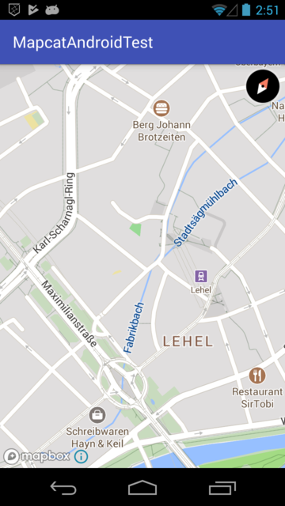
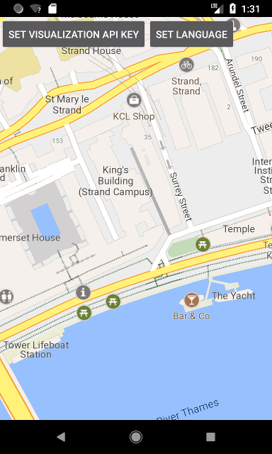

# Using Mapcat maps on Android

You can visualize [Mapcat](https://mapcat.com) maps on Android devices using the following ways:
* [building](#building-the-sdk-from-source) our [Mapbox GL Native](https://github.com/MAPCATcom/mapbox-gl-native) fork SDK and its test application from source,
* [importing](#importing-the-sdk-to-your-project) our pre-built SDK library from Maven Central repository to your Android project,
* or if you just want to check out our **pre-built** version of the application, you can download it from [here](https://cdn-static.mapcat.com/apk/MapcatAndroidTestApp/latest/MapcatAndroidTestApp.apk).
The Mapcat Android SDK offers you a browser-independent, native solution for rendering Mapcat maps.

## API keys
In order to use the test app or create one using our SDK, you have to get your [MAPCAT API keys](https://www.mapcat.com/planpricing/).

## Building the SDK from source
[Here](https://github.com/MAPCATcom/mapbox-gl-native/tree/mapcat-master/platform/android) is a quick guide on **how to build** and deploy the Mapcat Android TestApp to your Android device.


## Importing the SDK to your project
If you want to create your own Android application that uses Mapcat maps, you can simply import our SDK library to your project following the guideline below.

### Android Studio
The supported IDE for developing a Mapcat map application is [Android Studio](https://developer.android.com/studio/index.html) that you can download from Google for free.
When you downloaded and started Android Studio, you can create an empty project.
In the "Create New Proect" wizard, you should check the "Phone and Tablet" option in the "Target Android Devices" step. The corresponding minimum Android API level you pick from the combo box should be 15 or higher.
On the "Add an Activity to Mobile" tab, the "Empty Activity" option should be selected.

### Gradle build file
In the `build.gradle` file, you should add the following:
```gradle
repositories {
    mavenCentral()
}
 
dependencies {
    implementation 'com.mapcat.mapcatsdk:mapcat-android-sdk:1.0.4'
    implementation 'com.mapbox.mapboxsdk:mapbox-android-services:2.2.9'
}
```
### Location permission
You should extend the `AndroidManifest.xml` file, so your app will have the fine location permission:
```xml
<?xml version="1.0" encoding="utf-8"?>
<manifest>
    ...
    <uses-permission android:name="android.permission.ACCESS_FINE_LOCATION" />
    ...
</manifest>
```
### Activity
Now, in your main activity (`MainActivity.java` by default), you can create a map view:
```java
import android.support.v7.app.AppCompatActivity;
import android.os.Bundle;

import com.mapcat.mapcatsdk.Mapcat;
import com.mapcat.mapcatsdk.maps.MapView;
import com.mapcat.mapcatsdk.maps.LayerOptions;

public class MainActivity extends AppCompatActivity {
    private MapView mapView;

    @Override
    protected void onCreate(Bundle savedInstanceState) {
        super.onCreate(savedInstanceState);
        Mapcat.getInstance(this, "< Your MAPCAT Visualization API key >");
        setContentView(R.layout.activity_main);
        mapView = (MapView) findViewById(R.id.mapcatView);
        mapView.initMapcatMap(new LayerOptions(false, false));
        mapView.onCreate(savedInstanceState);
    }
    @Override
        public void onStart() {
        super.onStart();
        mapView.onStart();
    }
 
    @Override
    public void onResume() {
        super.onResume();
        mapView.onResume();
    }
 
    @Override
    public void onPause() {
        super.onPause();
        mapView.onPause();
    }
     
    @Override
    public void onStop() {
        super.onStop();
        mapView.onStop();
    }
     
    @Override
    public void onLowMemory() {
        super.onLowMemory();
        mapView.onLowMemory();
    }
     
    @Override
    protected void onDestroy() {
        super.onDestroy();
        mapView.onDestroy();
    }
     
    @Override
    protected void onSaveInstanceState(Bundle outState) {
        super.onSaveInstanceState(outState);
        mapView.onSaveInstanceState(outState);
    }
}
```
### Layout
Lastly, you have to place a "MapView" in your `activity_main.xml` layout file:
```xml
<?xml version="1.0" encoding="utf-8"?>
<RelativeLayout
    xmlns:android="http://schemas.android.com/apk/res/android"
    xmlns:tools="http://schemas.android.com/tools"
    android:layout_width="match_parent"
    android:layout_height="match_parent"
    tools:context="com.mapcat.mapcatsdk.mapcatandroidtest.MainActivity">

    <com.mapcat.mapcatsdk.maps.MapView
        android:id="@+id/mapcatView"
        android:layout_width="match_parent"
        android:layout_height="match_parent" />

</RelativeLayout>
```
### Building & Running the App
Click **Run -> Run 'app'** in the menu to build and run your application.
After successful startup, you should see something similar on the display of your device / emulator:



## Mapcat map with Tangram ES

You can visualize [Mapcat](https://mapcat.com) maps on Android devices also using our [Tangram ES fork](https://github.com/MAPCATcom/tangram-es).
Tangram ES is a C++ library for rendering 2D and 3D maps from vector data using OpenGL ES. It is a counterpart to [Tangram](https://github.com/tangrams/tangram) that targets mobile and embedded devices.

There are the following ways to check out how it works:

* go to our [GitHub repository](https://github.com/MAPCATcom/tangram-es), clone the project and follow the [instructions](https://github.com/MAPCATcom/tangram-es/tree/mapcat-master/platforms/android)

* if you just want to check out our **pre-built** version of the Tangram demo application, you can download it from [here](https://cdn-static.mapcat.com/apk/MapcatAndroidTangramTestApp/latest/MapcatAndroidTangramTestApp.apk)

### Building & Running the App
Click **Run -> Run 'app'** in the menu to build and run your application.
After successful startup, you should see something similar on the display of your device / emulator:


