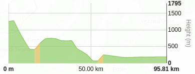

# Height API

Mapcat Height API is used to query elevation values at specific geo-coordinates. Height API is extremely useful for creating elevation profiles for routes.



You can find a detailed description of the request parameters and the response scheme of the API point in our [swagger documentation](../swagger#/VIS_API/post_relief_heights).  

## Example
Here is a simple javascript example below showing how to use our Height API from browser:

```js
var req = new XMLHttpRequest();

var reqListener = function(e) {
    console.log(req.response); // logging the elevation response to the console
};
req.addEventListener('load', reqListener);
req.open('POST', 'https://api-dev.mapcat.com/relief/heights', true);
req.setRequestHeader('X-Api-Key', '<YOUR MAPCAT ACCESS TOKEN>');
req.send('[[4.898089,52.372513],[4.898175,52.37259],[4.898445,52.372838],[4.898681,52.373061],[4.899111,52.372921],[4.899191,52.372905]]');
```

## Parameters
There are no url parameters to specify. 

## POST data
The geo-coordinates for which you want to retrieve the elevation values should be put to the _POST_ data of the xhr request. It should have the following json format: array of pairs of numbers (arrays of size 2), each pair representing the _longitude_ and _latitude_ coordinates of the geopoint.

## Response
The response is a json object. It contains `meta` and `result` fields.
The _meta_ field has `version`, `status_code` and `message` values. Field _version_ represents the version of the Height API engine, the _status_code_ is equal to the http status code of the response, and the _message_ string field contains a detailed error message if any.
When there was no error during processing the request, the `result` array field gives us the elevations (in meters) at the requested points. The size of the _result_ array is always equal to the size of the request array specified in the POST data.
